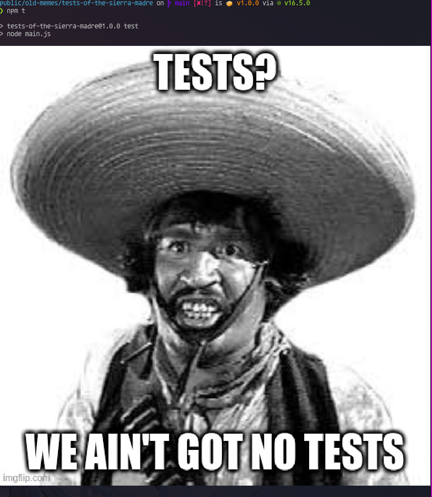

# The Tests of the Sierra Madre

a program that announces to the world that your project has no tests. it looks
like this:



## usage

first, install it as a dev dependency:

```sh
npm i --save-dev tests-of-the-sierra-madre
```

then, edit your `package.json` so it calls `tests-of-the-sierra-madre` in its
test run-script. for example:

```json
{
  "name": "my-app",
  "version": "1.0.0",
  "description": "just a humble app",
  "main": "index.js",
  "dependencies": {
    "tests-of-the-sierra-madre": "~1.0.0"
  },
  "scripts": {
    "test": "tests-of-the-sierra-madre"
  },
  "author": "You, probably",
  "license": "MIT"
}
```

## license

this project uses an MIT license.
